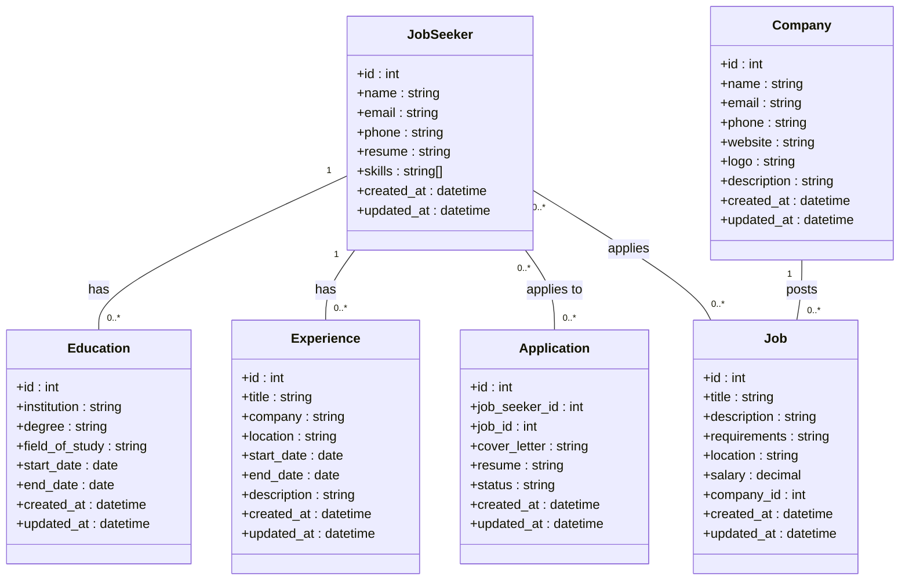

# Database Relationships

1. **User - JobSeeker Relationship:**
   - A User can have an optional association with a JobSeeker entity (0 or 1).
   - This relationship represents the connection between a User and their Job Seeker profile.
   - It allows the User to have additional attributes specific to being a Job Seeker, such as a resume and skills.

2. **User - Company Relationship:**
   - A User can have an optional association with a Company entity (0 or 1).
   - This relationship represents the connection between a User and their Company profile.
   - It allows the User to have additional attributes specific to being a Company, such as a company name, website, logo, and description.

3. **JobSeeker - Education Relationship:**
   - A JobSeeker can have zero or more Education entities.
   - This relationship represents the educational background of a Job Seeker.
   - It allows the Job Seeker to store information such as the institution, degree, field of study, and dates of education.

4. **JobSeeker - Experience Relationship:**
   - A JobSeeker can have zero or more Experience entities.
   - This relationship represents the professional experience of a Job Seeker.
   - It allows the Job Seeker to store information such as job titles, company names, locations, dates of employment, and job descriptions.

5. **JobSeeker - Application Relationship:**
   - A JobSeeker can apply to zero or more Job entities.
   - This relationship represents the applications made by a Job Seeker for different jobs.
   - It allows the Job Seeker to store application details such as a cover letter, resume, application status, and timestamps.

6. **Company - Job Relationship:**
   - A Company can post zero or more Job entities.
   - This relationship represents the job listings posted by a Company.
   - It allows the Company to provide details about the job, including the job title, description, requirements, location, salary, and timestamps.

These relationships define the associations and dependencies between the entities in the database schema, enabling the job board website to maintain structured data and support various operations related to job seekers, companies, education, experience, job applications, and job postings.

## Why User Parent entity 

Advantages of having a parent "User" entity:

Code reusability: If there are common attributes between Job Seekers and Companies (such as name, email, phone), having a shared parent entity allows you to define and manage those attributes in one place, promoting code reuse and reducing redundancy.
Simplified authentication and authorization: With a shared "User" entity, you can have a single authentication and authorization system that can handle both Job Seekers and Companies.
Flexibility for future role additions: If you anticipate the need to add more user roles or entities in the future, having a parent "User" entity provides a foundation to easily accommodate those roles.

